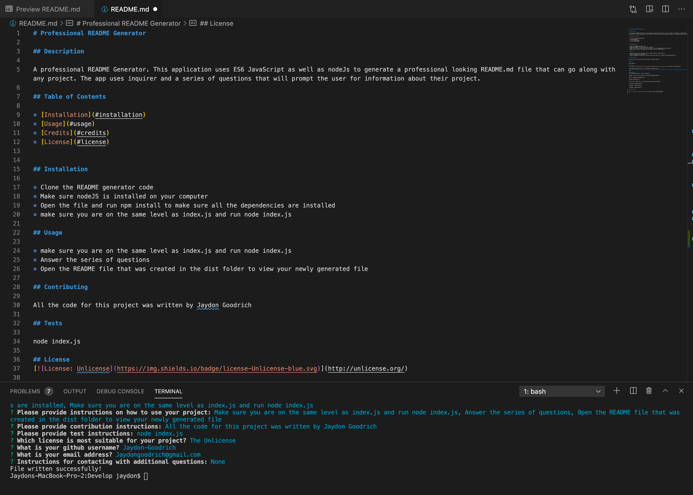

# Professional README Generator

## Description

A professional README Generator. This application uses ES6 JavaScript as well as nodeJs to generate a professional looking README.md file that can go along with any project. The app uses inquirer and a series of questions that will prompt the user for information about their project.

## Table of Contents

* [Installation](#installation)
* [Usage](#usage)
* [Credits](#credits)
* [License](#license)

## Installation

* Clone the README generator code
* Make sure nodeJS is installed on your computer
* Open the file and run npm install to make sure all the dependencies are installed
* make sure you are on the same level as index.js and run node index.js

## Usage 

* make sure you are on the same level as index.js and run node index.js
* Answer the series of questions
* Open the README file that was created in the dist folder to view your newly generated file

## Contributing

All the code for this project was written by Jaydon Goodrich

## Tests

node index.js

## License

Code released under the [Unlicense](http://unlicense.org/)

****

## Questions
For further questions I can be reached at:

GitHub: [Jaydon-Goodrich](https://github.com/Jaydon-Goodrich)

Email: JaydonGoodrich@gmail.com

Further Instructions: 

You can also reach out on the following social media platforms:

Instagram: Jaydon-Goodrich

Facebook: Jaydon-Goodrich

LinkedIn: Jaydon-Goodrich
    
## Reference

[Link to Youtube showing this project](https://youtu.be/mXaLOj4WuHU)

